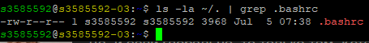

# Настройка цветного Bash prompt (file bash-promt.sh)



The setup information from the site was used [Bash prompt manual](https://wiki.archlinux.org/title/Bash/Prompt_customization).

1. Download the bash-promt.sh file from the repository
    ```bash
    wget https://github.com/SuhanovAA/sysadmin-toolbox/tree/main/linux-scripts/bash-promt.sh
    ```
    or
    ```bash
    curl -O https://github.com/SuhanovAA/sysadmin-toolbox/tree/main/linux-scripts/bash-promt.sh
    ```
    
2. Add the following code to your `~/.bashrc` file:

    ```bash
    # My console view (PS1)
    RED='\[\e[31m\]'
    GREEN='\[\e[32m\]'
    YELLOW='\[\e[33m\]'
    BLUE='\[\e[34m\]'
    RESET='\[\e[0m\]'

    PS1="${GREEN}\u${RESET}@${YELLOW}\h${RESET}:${BLUE}\w${RESET}\$ "

    export PS1
    ```
