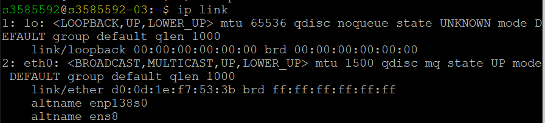

# Manual network configuration in Linux

## Command ip link

The ip link command in Linux is used to display and manage network interfaces. It's part of the ip utility, which is more modern and flexible than older tools like ifconfig.

1. View all network interfaces:
```bash
ip link
```
or
```bash
ip link show
```
The lists all network interfaces with their index numbers, names, MAC addresses, and states.


* 2: – Interface index
* eth0: – Interface name
* Flags: UP, LOWER_UP, etc.
* mtu – Maximum packet size
* link/ether – MAC address

2. Bring an interface up/down
```bash
sudo ip link set dev eth0 up
```
or
```bash
sudo ip link set dev eth0 down
```
3. Change MAC-address
```bash
sudo ip link set dev eth0 address 00:aa:11:bb:22:cc
```
4. Set MTU
```bash
sudo ip link set dev eth0 mtu 1499
```
5. Add/delete new virtual interface
```bash
sudo ip link add type <name-interface>
sudo ip link delete <name-interface>
```

### Settings 
```bash
sudo ip link add eth1 type dummy 
# dummy - virtual interface for testing
sudo ip link set eth1 up
ip link # view all interface
ip address show eth1 # show info new interface
sudo ip address add 10.1.1.10/24 dev eth1 # add ip for new interface
# sudo ip address del 10.1.1.10/24 dev eth1 - delete address
ip route show # ip r
```
## Other info

# Network Manager && Systemd-networkd

## Network Manager (nmcli)

```bash
nmcli <options> <object> <command> <parametrs>
```

If you use `nmcli device show` and get `unmanaged`, you need to change the value `managed=false` to `true` in the file /etc/NetworkManaged/NetworkManaged.conf


### nmcli device

* management of network interfaces.

### nmcli connection (or gui nmtui)

* connection management. This is the main object we will need.

```bash
nmcli connection show
sudo nmcli connection add con-name test type ethernet ifname eth0 ipv4.method auto
sudo nmcli con clone test test1
sudo nmcli con edit test #  <edit> or <modify> parametr
sudo nmcli con modify test ipv4.address 192.168.1.10/24 ipv4.method manual # edit ipv4
sudo nmcli con modify test ipv4.gateway 192.168.1.1 # route to gateway
nmcli -p con show test # view connect through test
sudo nmcli con up test # <up> or <down> parametr
sudo systemctl restart NetworkManager # or sudo nmcli reload
```

### nmcli networking

* network status management: turning it on and off, checking.

### nmcli general

* the state if al network protocols and NetworkManager as a whole.

### nmcli radio

* management if wireless network protocols.

## Systemd-networkd

The settings files for this service are stored in  /etc/systemd/network/ the same format inias NetworkManager (lower priority paths are /lib/systemd/network/ and  /run/systemd/network/). In total, three file extensions are supported:
* .link — describe the physical parameters of interfaces,
* .netdev — describe virtual interfaces,
* .network — contain network settings.

```bash
networkctl # view network connection
networkctl status
networkctl status -all
```

Parameters `Link File` and  `Network File` point to files that describe the settings.
Let's look at an example of setting up a network connection. Instead of defining via DHCP, we will set the parameters explicitly, and take the data from the output `networkctl status`. Since `systemd-networkd` it automatically defines devices and their basic settings, there is no need to create files describing the physical parameters of the interfaces.